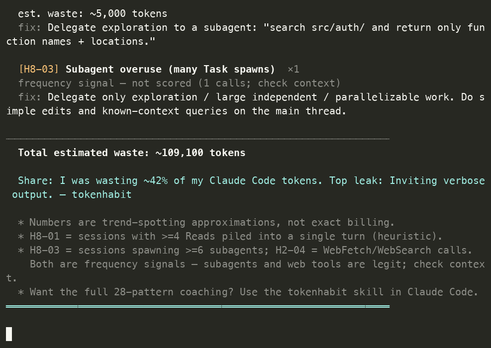

# tokenhabit

[](https://pypi.org/project/tokenhabit/)
[](https://pypi.org/project/tokenhabit/)
[](LICENSE)
[](pyproject.toml)

**무엇이 당신의 Claude Code 토큰을 새게 하는가?** 로컬 로그를 스캔해 한 줄로 알려줍니다.

`ccusage`가 *얼마* 썼는지 알려준다면, **`tokenhabit`은 *어떤 습관이* 그걸 썼는지 — 그리고 어떻게 멈추는지**를 알려줍니다.

LLM 호출 0회. 의존성 0개. 내 `~/.claude` 로그 위에서 완전히 오프라인으로 작동합니다.

[English README →](README.md)

---



<sub>합성 로그 기준 예시 실행 — 실제 수치는 다릅니다.</sub>

```console
$ uvx tokenhabit --lang ko

════════════════════════════════════════════════════════════════
tokenhabit — 습관 진단 리포트   2026-06-15 17:29
기간: 최근 7일  |  세션 파일: 236개  |  분석 세션: 236개
════════════════════════════════════════════════════════════════

[총계]  누적 토큰: 9,166,840  |  input: 4,775,023  |  output: 4,390,643
        캐시 히트: 1,251,474,403 (95.3%)

  토큰 낭비 점수: C  —  토큰의 약 14%가 습관적으로 낭비됨 (8,370,759 tok)

[감지된 습관 패턴]  (카탈로그 ID, 빈도 내림차순)
────────────────────────────────────────────────────────────────

  [H1-03] compaction 버스 막차 (누적 토큰 과다)  ×217
  추정 낭비: ~3,255,000 토큰
  즉시 fix: 50K 토큰 전에 수동 /compact [포커스 지시] 실행.

  공유: 내 Claude Code 토큰의 약 14%를 낭비하고 있었다. 1위 누수: compaction 버스 막차. — tokenhabit
```

---

## 빠른 시작

설치 없이:

```bash
uvx tokenhabit            # uv 사용 (추천)
pipx run tokenhabit       # pipx 사용
```

설치해서 쓰려면:

```bash
uv tool install tokenhabit
# 또는
pip install tokenhabit
```

그다음 `tokenhabit --lang ko` 만 실행하면 됩니다. 최근 7일 `~/.claude/projects/*.jsonl` 을 스캔해 리포트를 출력합니다.

> 최신 개발 버전을 원하면 레포에서 바로 실행:
> `uvx --from git+https://github.com/epoko77-ai/tokenhabit tokenhabit --lang ko`

## 사용법

```bash
tokenhabit --lang ko                  # 최근 7일, 전체 프로젝트
tokenhabit --lang ko --days 14        # 최근 14일
tokenhabit --lang ko --project /path  # 특정 프로젝트
tokenhabit --lang ko --session run.jsonl  # 단일 세션 파일
tokenhabit --json                     # 기계가 읽는 출력 (CI/파이핑)
tokenhabit --lang ko --ccusage        # ccusage daily 총계 함께 표시
```

## 무엇을 감지하나

로그에서 직접 정량 측정 가능한 10개 습관:

| ID | 습관 | 즉시 fix |
|----|------|---------|
| **H1-01** | 주제 드래그 / 장시간 세션 | 작업 전환 시 `/clear`·`/compact` |
| **H1-03** | compaction 버스 막차 (누적 토큰 과다) | 50K 전 수동 `/compact [포커스]` |
| **H2-01** | 파일 리드 재탕 | 컨텍스트 내 참조 유도 |
| **H2-02** | 로그 전체 덤프 / stdout 홍수 | `grep`·`head`로 먼저 필터 |
| **H2-04** | 웹 결과 방치 *(신호)* | 리서치는 서브에이전트로 위임 |
| **H4-03** | 캐시 킬 스위치 (히트율 급락) | 세션 중 모델·effort 전환 자제 |
| **H5-04** | 장황 출력 유도 | 출력 제한("2줄로만") |
| **H8-01** | 메인 스레드 탐색 | 탐색은 서브에이전트로 위임 |
| **H8-02** | stdout 홍수 (Bash 대형 출력) | `head`로 파이프·파일 저장 |
| **H8-03** | 서브에이전트 남발 *(신호)* | 대형 독립 작업만 위임 |

이 10개는 전체 **28패턴** 카탈로그의 일부입니다(*신호* = 빈도만 집계, Waste 점수 미반영). 나머지(프롬프트 명료성·CLAUDE.md 위생·MCP 구성 등)는 로그만으로 판정할 수 없어, 전체 코칭은 아래 Claude Code 스킬이 담당합니다.

## 점수 계산 방식

**토큰 낭비 점수**는 공유 가능한 헤드라인입니다 — 추정 낭비 토큰을 *과금 대상 작업* 토큰(input + output + cache creation) 대비 비율로 표시합니다. 캐시 **read**는 분모에서 의도적으로 제외합니다(값이 싸고 양이 압도적이라 포함하면 모든 점수가 ~1%로 뭉개집니다).

모든 수치는 **경향 파악용 근사치이며 정확한 과금이 아닙니다.** 목적은 *어떤* 습관이 지배적인지 드러내는 것이지, 청구서를 맞추는 게 아닙니다.

## ccusage와의 차이

| | ccusage | tokenhabit |
|---|---------|-----------|
| **질문** | 얼마 썼나? | 어떤 *습관이* 썼나? |
| **출력** | 비용·토큰 총계 | 순위화된 습관 + 복붙 fix |
| **LLM 호출** | 없음 | 없음 |

상호 보완적입니다. ccusage는 측정하고, tokenhabit은 진단·처방합니다. `tokenhabit --ccusage`로 둘을 함께 볼 수 있습니다.

## Claude Code 스킬

tokenhabit은 전체 28패턴 카탈로그 인터랙티브 코칭(세션 진단·프롬프트 재작성·런타임 가드 훅)을 위한 Claude Code **스킬**로도 제공됩니다. [`skill/`](skill/) 참고. CLI는 빠른 오프라인 스캔, 스킬은 더 깊은 코치입니다.

## 프라이버시

모두 로컬에서 작동합니다. 내 `~/.claude` 로그 파일만 읽으며 어디로도 전송하지 않습니다.

## 라이선스

MIT © 이승현
