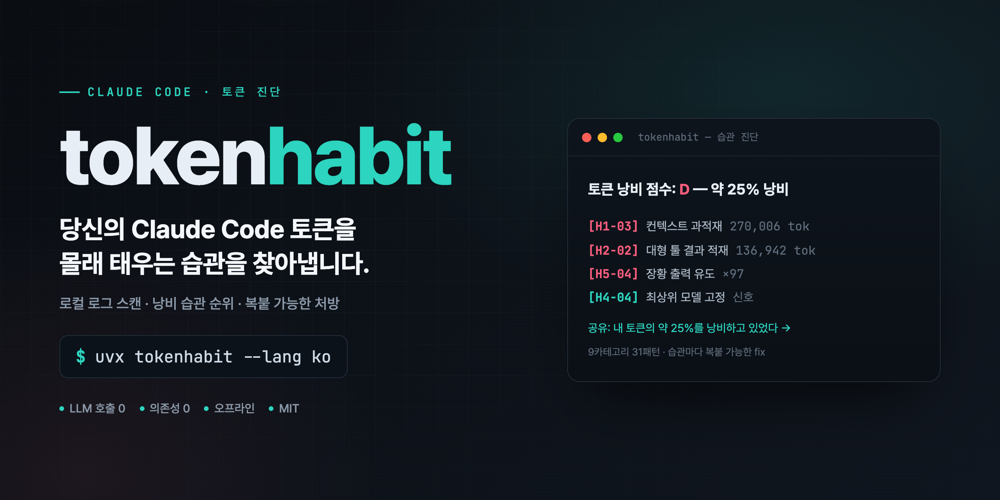

<p align="center">
  
</p>

<p align="center"><sub>쓸만했다면 ⭐ 한 번 — 다른 사람이 찾는 데 도움이 돼요.</sub></p>

# tokenhabit

[](https://pypi.org/project/tokenhabit/)
[](https://pypi.org/project/tokenhabit/)
[](LICENSE)
[](pyproject.toml)

**무엇이 당신의 Claude Code 토큰을 새게 하는가?** 로컬 로그를 스캔해 한 줄로 알려줍니다.

`ccusage`가 *얼마* 썼는지 알려준다면, **`tokenhabit`은 *어떤 습관이* 그걸 썼는지 — 그리고 어떻게 멈추는지**를 알려줍니다.

LLM 호출 0회. 의존성 0개. 내 `~/.claude` 로그 위에서 오프라인으로 작동합니다 — 네트워크를 쓰는 건
opt-in `--ccusage` 플래그뿐입니다.

[English README →](README.md)

---


<sub>합성 로그 기준 예시 실행(`python3 tests/make_demo_logs.py --lang ko` 로 재생성) — 실제 수치는 다릅니다.</sub>

```console
$ uvx tokenhabit --lang ko

════════════════════════════════════════════════════════════════
tokenhabit — 습관 진단 리포트   2026-08-12 19:05
기간: 최근 7일  |  세션 파일: 6개  |  분석 세션: 6개
════════════════════════════════════════════════════════════════

[총계]  누적 토큰: 32,867,527  |  input: 121,953  |  output: 556,986
        캐시 히트: 31,576,016 (96.1%)

  토큰 낭비 점수: F  —  토큰의 약 86%가 습관적으로 낭비됨 (1,111,076 tok)

[감지된 습관 패턴]  (카탈로그 ID, 빈도 내림차순)
────────────────────────────────────────────────────────────────

  [H2-01] 파일 리드 재탕  ×194
  추정 낭비: ~388,000 토큰 (시나리오 상수 × 횟수)
  즉시 fix: 같은 파일 재읽기 대신 "아까 읽은 X에서..." 컨텍스트 참조 유도. PreToolUse hook으로 차단.

  [H5-04] 장황 출력 유도  ×110
  추정 낭비: ~88,000 토큰 (시나리오 상수 × 횟수)
  즉시 fix: "2줄로만" "코드·예시 없이" 등 출력 제한 명시. CLAUDE.md에 기본값 설정.

  [H8-02] stdout 홍수 (Bash 결과 대형)  ×29
  실측 낭비: 172,666 토큰 (로그의 실제 토큰 수)
  즉시 fix: Bash 명령에 | head -50 또는 | grep 필터 추가. 파일 저장 후 경로만 전달.

  [H1-01] 주제 드래그 (무거운 컨텍스트를 끌고 가는 장시간 세션)  ×6
  빈도 신호 — 점수 미반영 (6; 맥락으로 판단)
  즉시 fix: 작업이 바뀌면 /clear. 돌아올 세션은 /rename으로 이름을 붙여두고 claude --resume으로 복귀.

  [H1-03] 컨텍스트 과적재 (한 턴 최대 컨텍스트가 상한 초과)  ×6
  실측 낭비: 432,410 토큰 (로그의 실제 토큰 수)
  즉시 fix: 컨텍스트가 ~50K를 넘기 전에 /compact [포커스 지시] 실행. 쌓아둔 만큼이 이후 모든 턴에 다시 실린다.

  [H8-01] 메인 스레드 탐색 (한 턴 Read 다수)  ×6
  추정 낭비: ~30,000 토큰 (시나리오 상수 × 횟수)
  즉시 fix: 서브에이전트로 탐색 위임: "src/auth/ 에서 OAuth 함수 찾아서 이름·위치만 요약."

  [H4-04] 최상위 모델 고정 주행 (티어 전환 0회)  ×4
  빈도 신호 — 점수 미반영 (4; 맥락으로 판단)
  즉시 fix: 공식 정가 기준 Opus 5 대 Haiku 4.5는 5배, Fable 5 대 Haiku 4.5는 10배 차이다. 작업별로 라우팅하라 — 기계적 편집은 /model로 낮은 티어, 린트·포맷·리네임은 애초에 모델이 필요 없다.

────────────────────────────────────────────────────────────────
  총 낭비: ~1,111,076 토큰

  공유: 내 Claude Code 토큰의 약 86%를 낭비하고 있었다. 1위 누수: 컨텍스트 과적재 (한 턴 최대 컨텍스트가 상한 초과). — tokenhabit

  * 수치는 경향 파악용 근사치이며 정확한 과금이 아닙니다.
  * 한 턴 = message id 하나. 병렬 툴 호출은 한 턴으로 셉니다.
    컨텍스트 크기 = 한 턴의 input + cache_read + cache_creation.
  * H8-01 = 한 턴에 Read 4개 이상 몰아 읽은 세션 수 (근사).
  * 신호(점수 미반영): H8-03 세션당 서브에이전트 6개 이상, H2-04 웹 호출 수,
    H1-01 무거운 컨텍스트의 장시간 세션, H4-04 최상위 티어 고정 주행.
  * 서브에이전트 트랜스크립트는 제외 — 에이전트가 아니라 당신의 습관을 채점합니다.
  * 전체 31패턴 코칭이 필요하면 Claude Code의 tokenhabit 스킬을 사용하세요.
════════════════════════════════════════════════════════════════
```

---

## 빠른 시작

설치 없이:

```bash
uvx tokenhabit            # uv 사용 (추천)
pipx run tokenhabit       # pipx 사용
```

설치해서 쓰려면:

```bash
uv tool install tokenhabit
# 또는
pip install tokenhabit
```

그다음 `tokenhabit --lang ko` 만 실행하면 됩니다. 최근 7일 `~/.claude/projects/**/*.jsonl` 을 스캔해 리포트를 출력합니다.

> 최신 개발 버전을 원하면 레포에서 바로 실행:
> `uvx --from git+https://github.com/epoko77-ai/tokenhabit tokenhabit --lang ko`

## 사용법

```bash
tokenhabit --lang ko                  # 최근 7일, 전체 프로젝트
tokenhabit --lang ko --days 14        # 최근 14일
tokenhabit --lang ko --current        # 현재(가장 최근) 세션 1개만
tokenhabit --lang ko --project /path  # 특정 프로젝트
tokenhabit --lang ko --session run.jsonl  # 단일 세션 파일
tokenhabit --json                     # 기계가 읽는 출력 (CI/파이핑)
tokenhabit --lang ko --include-subagents  # 서브에이전트 트랜스크립트도 채점 (기본 제외)
tokenhabit --lang ko --ccusage        # ccusage daily 총계 함께 표시 (네트워크)
```

## 무엇을 감지하나

로그에서 직접 정량 측정 가능한 11개 습관:

| ID | 습관 | 즉시 fix |
|----|------|---------|
| **H1-01** | 주제 드래그 *(신호)* | 작업 전환 시 `/clear`·`/compact` |
| **H1-03** | 컨텍스트 과적재 (한 턴 최대치가 상한 초과) | 50K 전 수동 `/compact [포커스]` |
| **H2-01** | 파일 리드 재탕 | 컨텍스트 내 참조 유도 |
| **H2-02** | 대형 툴 결과 컨텍스트 적재 | 요청 전에 범위를 좁혀라 |
| **H2-04** | 웹 결과 방치 *(신호)* | 리서치는 서브에이전트로 위임 |
| **H4-03** | 캐시 킬 스위치 (세션 중 모델 전환) | 티어를 시작 전에 결정 |
| **H4-04** | 최상위 모델 고정 주행 *(신호)* | 작업별 라우팅. 린트·포맷·리네임은 모델 없이 도구로 |
| **H5-04** | 장황 출력 유도 | 출력 제한("2줄로만") |
| **H8-01** | 메인 스레드 탐색 | 탐색은 서브에이전트로 위임 |
| **H8-02** | stdout 홍수 (Bash 대형 출력) | `head`로 파이프·파일 저장 |
| **H8-03** | 서브에이전트 남발 *(신호)* | 대형 독립 작업만 위임 |

이 11개는 전체 **31패턴** 카탈로그의 일부입니다(*신호* = 빈도만 집계, Waste 점수 미반영). 나머지(프롬프트 명료성·CLAUDE.md 위생·MCP 구성·구독 중복 등)는 로그만으로 판정할 수 없어, 전체 코칭은 아래 Claude Code 스킬이 담당합니다.

서브에이전트 트랜스크립트는 **기본 제외**됩니다 — 에이전트가 자기 컨텍스트에서 한 일이 아니라 *당신의* 습관을 채점하기 때문입니다.

## 점수 계산 방식

**토큰 낭비 점수**는 공유 가능한 헤드라인입니다 — 추정 낭비 토큰을 *과금 대상 작업* 토큰(input + output + cache creation) 대비 비율로 표시합니다. 캐시 **read**는 분모에서 의도적으로 제외합니다(값이 싸고 양이 압도적이라 포함하면 모든 점수가 ~1%로 뭉개집니다).

낭비는 세 종류이고 리포트가 각각을 구분해 표기합니다:

- **실측** — 로그에 기록된 실제 토큰 수 기반(대형 툴 결과, 모델 전환이 강제한 캐시 재작성, 상한을 넘겨 끌고 간 컨텍스트)
- **추정** — 시나리오 상수 × 횟수. 방향만 참고
- **신호** — 세어서 보여주지만 점수에 합산하지 않음. 장시간 세션·웹 검색·서브에이전트·상위 티어 고정은 그 자체로 낭비가 아니기 때문

모든 수치는 **경향 파악용 근사치이며 정확한 과금이 아닙니다.** 목적은 *어떤* 습관이 지배적인지 드러내는 것이지, 청구서를 맞추는 게 아닙니다.

### 낭비를 줄이는 것과 적게 쓰는 것은 다르다

목표는 **같은 결과를 더 싸게 얻어 아낀 예산을 실제 작업에 쓰는 것**이지, Claude를 덜 쓰는 게 아닙니다. 토큰을 아끼느라 할 일을 못 끝내는 건 낭비보다 비싼 실수입니다. 여기 있는 모든 fix는 *아무것도 사주지 않은 토큰*만 제거하며, 작업량을 줄이라고 요구하지 않습니다.

### 수치의 출처에 대하여

토큰 절감 조언은 출처 없는 확신에 찬 숫자와 함께 유통됩니다. 이 프로젝트의 모든 가격·배수·절감률은 공급자 공식 문서로 역추적됩니다 — 캐시 읽기 **0.1x**, 캐시 쓰기 **1.25x**(5분 TTL)·**2x**(1시간), Opus 5 대 Haiku 4.5 정가 **5배**, Batch API **50%**. 널리 퍼진 주장이 공식 수치와 어긋나면 공식 수치를 쓰고 그 사실을 밝힙니다. [`skill/references/measurement_and_hooks.md`](skill/references/measurement_and_hooks.md) 참고.

## ccusage와의 차이

| | ccusage | tokenhabit |
|---|---------|-----------|
| **질문** | 얼마 썼나? | 어떤 *습관이* 썼나? |
| **출력** | 비용·토큰 총계 | 순위화된 습관 + 복붙 fix |
| **LLM 호출** | 없음 | 없음 |

상호 보완적입니다. ccusage는 측정하고, tokenhabit은 진단·처방합니다. `tokenhabit --ccusage`로 둘을 함께 볼 수 있습니다.

## Claude Code 스킬

tokenhabit은 전체 31패턴 카탈로그 인터랙티브 코칭(세션 진단·프롬프트 재작성·런타임 가드 훅)을 위한 Claude Code **스킬**로도 제공됩니다. [`skill/`](skill/) 참고. CLI는 빠른 오프라인 스캔, 스킬은 더 깊은 코치입니다.

탐지 로직의 단일 진실 원천은 `tokenhabit/` 패키지 하나입니다. 스킬은 pip 설치 없이도 돌도록 `skill/scripts/_vendor/` 에 생성된 사본을 함께 배포하며, 둘이 갈라지면 `python3 skill/scripts/sync_vendor.py --check` 가 CI를 실패시킵니다.

## 프라이버시

모두 로컬에서 작동합니다. 내 `~/.claude` 로그 파일만 읽으며 어디로도 전송하지 않습니다. (opt-in `--ccusage` 플래그만 `npx ccusage` 를 호출하며, 이때 npm 레지스트리에 접근합니다.)

## 라이선스

MIT © 이승현
