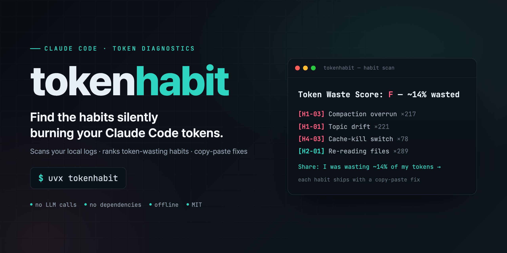

<p align="center">
  
</p>

# tokenhabit

[](https://pypi.org/project/tokenhabit/)
[](https://pypi.org/project/tokenhabit/)
[](LICENSE)
[](pyproject.toml)

**What's leaking your Claude Code tokens?** Scan your local logs and find out in one command.

`ccusage` tells you *how much* you spent. **`tokenhabit` tells you *which habits* spent it — and how to stop.**

No LLM calls. No dependencies. Runs fully offline on your own `~/.claude` logs.

[한국어 README →](README.ko.md)

---


<sub>Sample run on synthetic logs — your real numbers will differ.</sub>

```console
$ uvx tokenhabit

════════════════════════════════════════════════════════════════
tokenhabit — habit scan   2026-06-15 17:29
Window: last 7d  |  session files: 236  |  analyzed: 236
════════════════════════════════════════════════════════════════

[Totals]  tokens: 9,166,840  |  input: 4,775,023  |  output: 4,390,643
          cache hits: 1,251,474,403 (95.3%)

  Token Waste Score: C  —  ~14% of your tokens were likely wasted (8,370,759 tok)

[Detected habits]  (by catalog ID, most frequent first)
────────────────────────────────────────────────────────────────

  [H1-03] Compaction overrun (token pile-up)  ×217
  est. waste: ~3,255,000 tokens
  fix: Run /compact [focus] manually before you hit ~50K tokens.

  [H1-01] Topic drift / marathon session  ×221
  est. waste: ~2,210,000 tokens
  fix: At ~35 min / ~50K tokens, /compact or /clear and start a fresh session.

  [H4-03] Cache-kill switch (cache hit-rate crash)  ×78
  est. waste: ~1,638,000 tokens
  fix: Avoid switching model/effort mid-session. Open a new session when you must switch.

  ... (3 more)

  Share: I was wasting ~14% of my Claude Code tokens. Top leak: Compaction overrun. — tokenhabit
```

---

## Quick start

No install needed:

```bash
uvx tokenhabit            # with uv  (recommended)
pipx run tokenhabit       # with pipx
```

Or install it:

```bash
uv tool install tokenhabit
# or
pip install tokenhabit
```

Then just run `tokenhabit`. It scans `~/.claude/projects/*.jsonl` for the last 7 days and prints your report.

> Prefer the bleeding edge? Run straight from the repo:
> `uvx --from git+https://github.com/epoko77-ai/tokenhabit tokenhabit`

## Usage

```bash
tokenhabit                      # last 7 days, all projects
tokenhabit --days 14            # last 14 days
tokenhabit --project /path      # a single project directory
tokenhabit --session run.jsonl  # a single session file
tokenhabit --lang ko            # Korean report
tokenhabit --json               # machine-readable (CI / piping)
tokenhabit --ccusage            # also show `npx ccusage daily` totals
```

## What it detects

tokenhabit reads your raw session logs and flags the habits that quietly burn tokens. The ten it can measure directly from logs:

| ID | Habit | Fix |
|----|-------|-----|
| **H1-01** | Topic drift / marathon session | `/clear` or `/compact` at topic switches |
| **H1-03** | Compaction overrun (token pile-up) | Manual `/compact [focus]` before ~50K |
| **H2-01** | Re-reading the same file | Reference what's already in context |
| **H2-02** | Dumping full logs / stdout flood | Filter with `grep`/`head` first |
| **H2-04** | Stranded web results *(signal)* | Delegate research to a subagent |
| **H4-03** | Cache-kill switch (hit-rate crash) | Don't switch model/effort mid-session |
| **H5-04** | Inviting verbose output | Cap output ("in 2 lines") |
| **H8-01** | Main-thread exploration | Delegate sweeps to a subagent |
| **H8-02** | stdout flood (large Bash output) | Pipe to `head`/save to file |
| **H8-03** | Subagent overuse *(signal)* | Delegate only big independent work |

These are 10 of a larger 28-pattern habit catalog (*signal* = frequency-only,
not scored into the waste total). The remaining patterns
(prompt clarity, CLAUDE.md hygiene, MCP setup, …) can't be judged from logs
alone — for full interactive coaching, see [the Claude Code skill](#the-claude-code-skill) below.

## How the score works

The **Token Waste Score** is the share-worthy headline: estimated wasted tokens
as a percentage of your *billable work* tokens (input + output + cache creation).
Cache **reads** are deliberately excluded from the denominator — they're cheap and
so voluminous they'd dilute every score to ~1%.

All numbers are **trend-spotting approximations, not exact billing.** The point is
to surface *which* habit dominates, not to reconcile your invoice.

## How it differs from ccusage

| | ccusage | tokenhabit |
|---|---------|-----------|
| **Question** | How much did I spend? | Which *habits* spent it? |
| **Output** | Cost/token totals | Ranked habits + copy-paste fixes |
| **LLM calls** | none | none |
| Use them together | `tokenhabit --ccusage` shows both | |

They're complementary. ccusage measures; tokenhabit diagnoses and prescribes.

## The Claude Code skill

tokenhabit also ships as a Claude Code **skill** for interactive coaching across
the full 28-pattern catalog (session triage, prompt rewriting, runtime guard
hooks). See [`skill/`](skill/). The CLI is the fast offline scan; the skill is
the deeper coach.

## Privacy

Everything runs locally. tokenhabit only reads your own `~/.claude` log files and
never sends anything anywhere. (The optional `--ccusage` flag shells out to
`npx ccusage`, which is also local.)

## License

MIT © Seunghyun Lee
