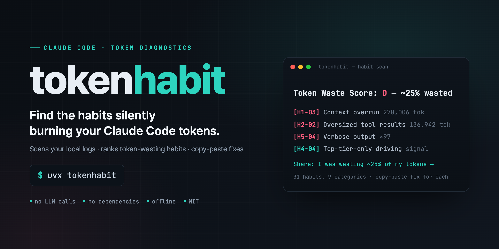
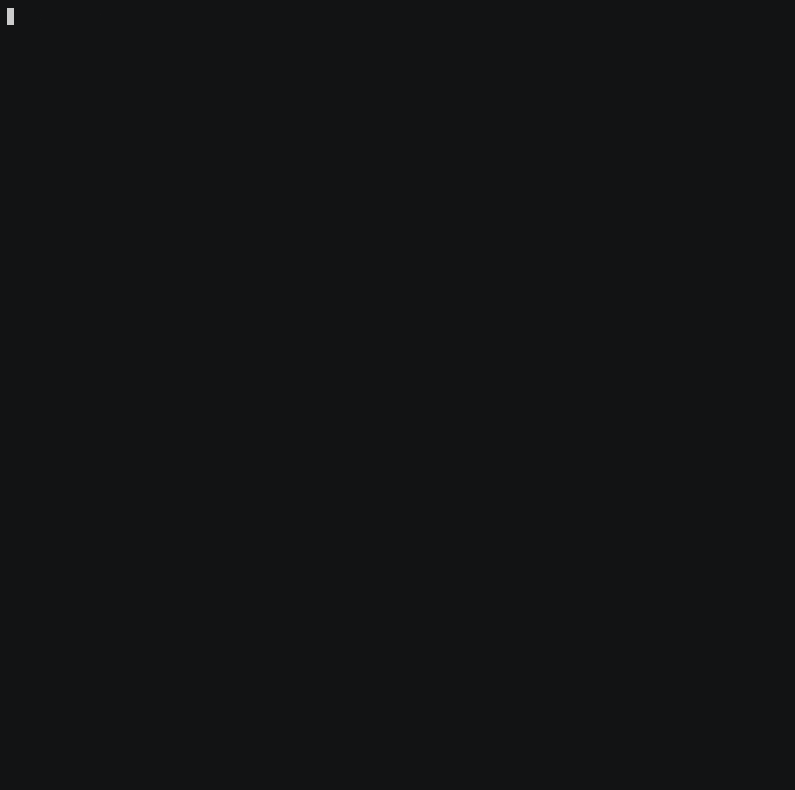

<p align="center">
  
</p>

<p align="center"><sub>Useful? Give it a ⭐ — it helps others find it.</sub></p>

# tokenhabit

[](https://pypi.org/project/tokenhabit/)
[](https://pypi.org/project/tokenhabit/)
[](LICENSE)
[](pyproject.toml)

**What's leaking your Claude Code tokens?** Scan your local logs and find out in one command.

`ccusage` tells you *how much* you spent. **`tokenhabit` tells you *which habits* spent it — and how to stop.**

No LLM calls. No dependencies. Runs offline on your own `~/.claude` logs — the only
network access is the opt-in `--ccusage` flag.

[한국어 README →](README.ko.md)

---



<sub>Sample run on synthetic logs (regenerate with `python3 tests/make_demo_logs.py`) — your real numbers will differ.</sub>

```console
$ uvx tokenhabit

════════════════════════════════════════════════════════════════
tokenhabit — habit scan   2026-08-12 19:05
Window: last 7d  |  session files: 6  |  analyzed: 6
════════════════════════════════════════════════════════════════

[Totals]  tokens: 32,867,527  |  input: 121,953  |  output: 556,986
          cache hits: 31,576,016 (96.1%)

  Token Waste Score: F  —  ~86% of your tokens were likely wasted (1,111,076 tok)

[Detected habits]  (by catalog ID, most frequent first)
────────────────────────────────────────────────────────────────

  [H2-01] Re-reading the same file  ×194
  est. waste: ~388,000 tokens (scenario constant x hits)
  fix: Reference what you already read ("from the X you read earlier...") instead of re-Reading. Block it with a PreToolUse hook.

  [H5-04] Inviting verbose output  ×110
  est. waste: ~88,000 tokens (scenario constant x hits)
  fix: Cap the output: "in 2 lines", "no code or examples". Set response defaults in CLAUDE.md.

  [H8-02] stdout flood (large Bash output)  ×29
  measured waste: 172,666 tokens (from logged token counts)
  fix: Add | head -50 or a grep filter to Bash commands. Save output to a file and pass the path.

  [H1-01] Topic drift (long session carrying a heavy context)  ×6
  frequency signal — not scored (6; check context)
  fix: When the task changes, /clear. Name the session with /rename first if you plan to come back via claude --resume.

  [H1-03] Context overrun (peak turn context past the ceiling)  ×6
  measured waste: 432,410 tokens (from logged token counts)
  fix: Run /compact [focus] before the context passes ~50K. Every later turn re-sends whatever you let pile up.

  [H8-01] Main-thread exploration (many Reads in one turn)  ×6
  est. waste: ~30,000 tokens (scenario constant x hits)
  fix: Delegate exploration to a subagent: "search src/auth/ and return only function names + locations."

  [H4-04] Top-tier-only driving (never switched models)  ×4
  frequency signal — not scored (4; check context)
  fix: Official list prices differ 5x (Opus 5 vs Haiku 4.5) to 10x (Fable 5 vs Haiku 4.5). Route by task: /model for lighter tiers on mechanical edits; lint, format and rename need no model at all.

────────────────────────────────────────────────────────────────
  Total waste: ~1,111,076 tokens

  Share: I was wasting ~86% of my Claude Code tokens. Top leak: Context overrun (peak turn context past the ceiling). — tokenhabit

  * Numbers are trend-spotting approximations, not exact billing.
  * A turn is one message id, so parallel tool calls count as one turn.
    Context size = input + cache_read + cache_creation of a single turn.
  * H8-01 = sessions with >=4 Reads piled into a single turn (heuristic).
  * Signals (not scored): H8-03 >=6 subagent spawns/session, H2-04 web calls,
    H1-01 long session on a heavy context, H4-04 never left the top model tier.
  * Subagent transcripts are excluded — this scores your habits, not an agent's.
  * Want the full 31-pattern coaching? Use the tokenhabit skill in Claude Code.
════════════════════════════════════════════════════════════════
```

---

## Quick start

No install needed:

```bash
uvx tokenhabit            # with uv  (recommended)
pipx run tokenhabit       # with pipx
```

Or install it:

```bash
uv tool install tokenhabit
# or
pip install tokenhabit
```

Then just run `tokenhabit`. It scans `~/.claude/projects/**/*.jsonl` for the last 7 days and prints your report.

> Prefer the bleeding edge? Run straight from the repo:
> `uvx --from git+https://github.com/epoko77-ai/tokenhabit tokenhabit`

## Usage

```bash
tokenhabit                      # last 7 days, all projects
tokenhabit --days 14            # last 14 days
tokenhabit --current            # only the current (most recent) session
tokenhabit --project /path      # a single project directory
tokenhabit --session run.jsonl  # a single session file
tokenhabit --lang ko            # Korean report
tokenhabit --json               # machine-readable (CI / piping)
tokenhabit --include-subagents  # also score subagent transcripts (off by default)
tokenhabit --ccusage            # also show `npx ccusage daily` totals (network)
```

## What it detects

tokenhabit reads your raw session logs and flags the habits that quietly burn tokens. The eleven it can measure directly from logs:

| ID | Habit | Fix |
|----|-------|-----|
| **H1-01** | Topic drift *(signal)* | `/clear` or `/compact` at topic switches |
| **H1-03** | Context overrun (peak turn past the ceiling) | Manual `/compact [focus]` before ~50K |
| **H2-01** | Re-reading the same file | Reference what's already in context |
| **H2-02** | Oversized tool results pulled into context | Narrow the request before you make it |
| **H2-04** | Stranded web results *(signal)* | Delegate research to a subagent |
| **H4-03** | Cache-kill switch (model swapped mid-session) | Decide the tier before you start |
| **H4-04** | Top-tier-only driving *(signal)* | Route by task; skip the model entirely for lint/format/rename |
| **H5-04** | Inviting verbose output | Cap output ("in 2 lines") |
| **H8-01** | Main-thread exploration | Delegate sweeps to a subagent |
| **H8-02** | stdout flood (large Bash output) | Pipe to `head`/save to file |
| **H8-03** | Subagent overuse *(signal)* | Delegate only big independent work |

These are 11 of a larger 31-pattern habit catalog (*signal* = frequency-only,
not scored into the waste total). The remaining patterns
(prompt clarity, CLAUDE.md hygiene, MCP setup, subscription overlap, …) can't be
judged from logs alone — for full interactive coaching, see
[the Claude Code skill](#the-claude-code-skill) below.

Subagent transcripts are **excluded by default**: this scores *your* habits, not
what an agent did inside its own context.

## How the score works

The **Token Waste Score** is the share-worthy headline: estimated wasted tokens
as a percentage of your *billable work* tokens (input + output + cache creation).
Cache **reads** are deliberately excluded from the denominator — they're cheap and
so voluminous they'd dilute every score to ~1%.

Waste comes in three flavours and the report labels each one:

- **measured** — taken from token counts the log actually recorded (oversized tool
  results, the cache re-warm a model switch forced, context carried past the ceiling)
- **estimated** — a scenario constant multiplied by a hit count; directional only
- **signal** — counted and shown, but *not* scored. A long session, a web search, a
  subagent, or staying on one model tier is not waste by itself.

All numbers are **trend-spotting approximations, not exact billing.** The point is
to surface *which* habit dominates, not to reconcile your invoice.

### Cutting waste is not spending less

The goal is to get the same result cheaper and spend what you save on actual work —
not to use Claude less. Rationing tokens until you can't finish the job is a more
expensive mistake than the waste itself. Every fix here removes tokens that bought
you nothing; none of them ask you to do less.

### On sourced numbers

Token-saving advice circulates with confident figures that have no primary source.
Every price, multiplier, and saving rate in this project is traceable to official
provider documentation — cache reads at **0.1x**, cache writes at **1.25x** (5-min
TTL) or **2x** (1-hour), Opus 5 to Haiku 4.5 list prices differing **5x**, Batch API
at **50%**. Where a popular claim conflicts with the official figure, we use the
official one and say so. See
[`skill/references/measurement_and_hooks.md`](skill/references/measurement_and_hooks.md).

## How it differs from ccusage

| | ccusage | tokenhabit |
|---|---------|-----------|
| **Question** | How much did I spend? | Which *habits* spent it? |
| **Output** | Cost/token totals | Ranked habits + copy-paste fixes |
| **LLM calls** | none | none |
| Use them together | `tokenhabit --ccusage` shows both | |

They're complementary. ccusage measures; tokenhabit diagnoses and prescribes.

## The Claude Code skill

tokenhabit also ships as a Claude Code **skill** for interactive coaching across
the full 31-pattern catalog (session triage, prompt rewriting, runtime guard
hooks). See [`skill/`](skill/). The CLI is the fast offline scan; the skill is
the deeper coach.

Detection logic lives in one place — the `tokenhabit/` package. The skill carries a
generated copy under `skill/scripts/_vendor/` so it runs without a pip install;
`python3 skill/scripts/sync_vendor.py --check` fails CI if the two ever drift.

## Privacy

Everything runs locally. tokenhabit only reads your own `~/.claude` log files and
never sends anything anywhere. (The optional `--ccusage` flag shells out to
`npx ccusage`, which is also local.)

## License

MIT © Seunghyun Lee
